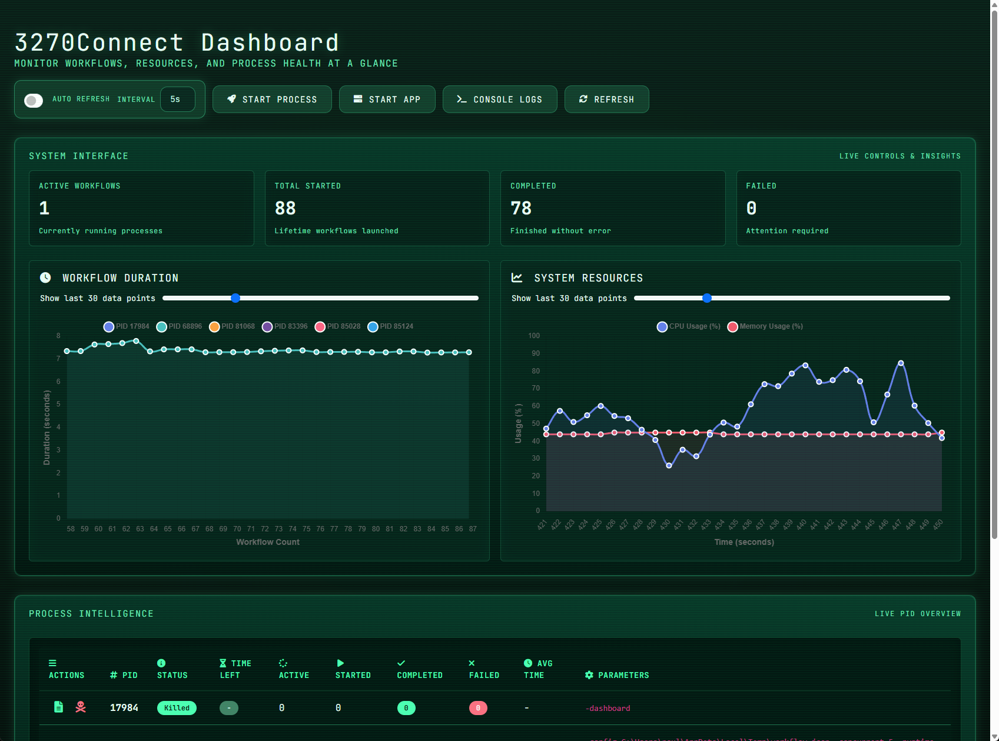
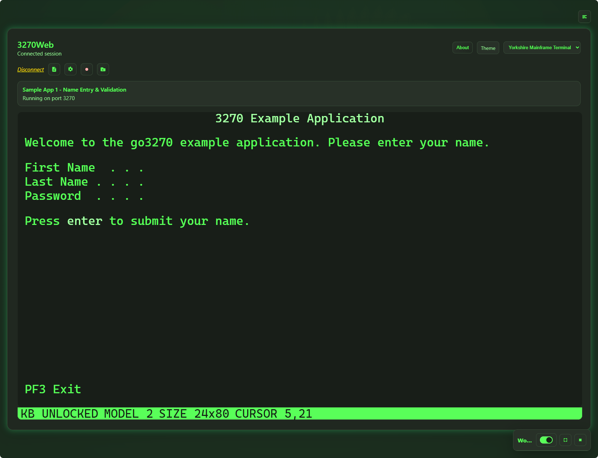

# 3270.io

Mainframe 3270 automation and web tooling for modern engineering workflows.

## Flagship Projects

### 3270Connect
Repeatable scripted workflows to replicate human 3270 online integration at unlimited scale. Includes a web dashboard, API, and CLI for functional and non-functional testing of mainframe 3270 online applications.



- Docs: https://3270connect.3270.io
- GitHub: https://github.com/3270io/3270Connect
- Highlights:
  - Define and execute automated workflows via configuration files
  - Capture 3270 screen state for documentation and troubleshooting
  - Run workflows in parallel for faster validation
  - Headless mode for CI/CD automation
  - API server for load testing and advanced orchestration

### 3270Web
Web-based 3270 terminal interface in Go with session recording to a 3270Connect-compatible workflow.



- Docs: https://3270web.3270.io
- GitHub: https://github.com/3270io/3270Web
- Highlights:
  - Browser UI for interactive 3270 sessions with detailed logging
  - Virtual keyboard support for full terminal interaction
  - Export sessions as `workflow.json` compatible with 3270Connect
  - Load and replay `workflow.json` for repeatable flows
  - Docker image and GHCR publishing workflow

## How They Work Together

Use `3270Web` to interactively build and record terminal sessions, then run those same workflows at scale with `3270Connect` in local, CI/CD, or load-testing pipelines.

## Website Repo

This repository contains the public landing page for 3270.io.

- Stack: React, TypeScript, Vite, Tailwind CSS
- App entry: `src/App.tsx`
- Product image config: `src/lib/dashboard-image.ts`

## Local Development

```bash
npm install
npm run dev
```

## License

MIT. See `LICENSE`.
