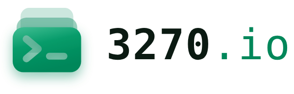
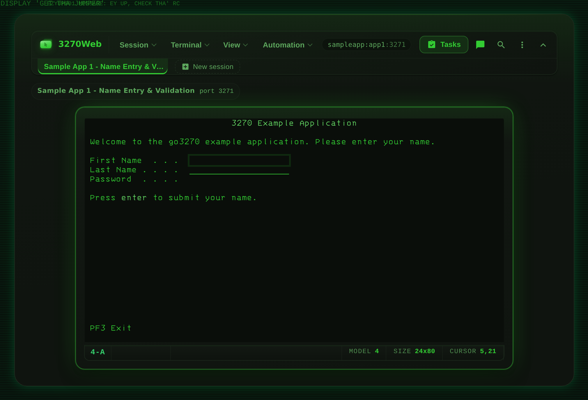

<picture>
  <source media="(prefers-color-scheme: dark)" srcset="brand/assets/3270io/3270io-lockup-600.png">
  
</picture>

Mainframe 3270 automation and web tooling for modern engineering workflows.

This repository is the landing page for [3270.io](https://3270.io) and the home
of the shared brand kit. The two products it launches into have their own repos
and their own MkDocs sites.

## The brand

<picture>
  <source media="(prefers-color-scheme: dark)" srcset="brand/assets/3270io/3270io-mark-128.png">
  
</picture>
<picture>
  <source media="(prefers-color-scheme: dark)" srcset="brand/assets/3270connect/3270connect-mark-128.png">
  
</picture>
<picture>
  <source media="(prefers-color-scheme: dark)" srcset="brand/assets/3270web/3270web-mark-128.png">
  
</picture>

One idea, three variants: **the session stack** — terminal screens receding in
depth, one session recorded and replayed many times. The plate, the stack and
the lighting model are shared; the fan direction and the glyph knocked out of
the front face are what differ. 3270.io fans straight up with the bare prompt,
3270Connect fans right with a doubled chevron, 3270Web fans up-right with a
mouse pointer.

Marks, lockups, favicons, the rules for using them, and the script that
generates the whole set live in [`brand/`](brand/). Both products carry the same
mark in their own UI, re-tinted from the active palette.

## Flagship Projects

### 3270Connect

<picture>
  <source media="(prefers-color-scheme: dark)" srcset="brand/assets/3270connect/3270connect-lockup-600.png">
  
</picture>

Repeatable scripted workflows that replicate human 3270 online integration at
unlimited scale — a CLI, an API server, and a live operations console served
straight from the binary, for functional and non-functional testing of mainframe
3270 applications.


- Docs: https://3270connect.3270.io
- GitHub: https://github.com/3270io/3270Connect
- Highlights:
  - Define and execute automated workflows via configuration files
  - Operations console with live KPIs, latency percentiles, log streaming and per-process control
  - Run workflows in parallel, with runtime windows, grace periods and per-workflow timeouts
  - Capture 3270 screen state for documentation and troubleshooting
  - Headless mode for CI/CD automation
  - API server for load testing and advanced orchestration
  - Prometheus `/metrics` endpoint for connect/step timing and live worker counts
  - Host compatibility profiler producing 3270Web-compatible JSON for cross-environment diffs
  - Hardened input handling: injection, filename, and path-traversal prevention

### 3270Web

<picture>
  <source media="(prefers-color-scheme: dark)" srcset="brand/assets/3270web/3270web-lockup-600.png">
  
</picture>

An **enterprise-grade 3270 terminal in the browser** — no emulator install, no
thick client — that also understands the application behind the screens. AI
auto-navigation explores the host and maps it, which makes the application
addressable in plain English and turns its full screen coverage into a load
profile for 3270Connect.



- Docs: https://3270web.3270.io
- GitHub: https://github.com/3270io/3270Web
- Highlights:
  - Enterprise browser UI for interactive 3270 sessions, with virtual keyboard and detailed logging
  - **Discover** — AI auto-navigation drives the host itself, mapping every screen and transition into a mind map
  - **Understand** — each screen annotated with its business purpose and field meanings, with named business functions catalogued like "Account inquiry"
  - **Operate in English** — "look up account 1234" drives the live session step by step, or emits a self-describing workflow JSON
  - **Record coverage** — full application screen coverage exported as 3270Connect-compatible `workflow.json` for performance and volume testing
  - AI Chat side panel with per-action approval or hands-free Auto Mode, and a model selector across GitHub Copilot models
  - Chaos Mind-Map Compare API for diffing host divergence across environments
  - Host compatibility profiler API producing 3270Connect-compatible JSON
  - IBM 3270 terminal fonts (Regular, Semi-Condensed, Condensed) bundled with the app
  - Hardened by default — CSP and security headers, origin/referer checks, CSRF validation, token-guarded REST API
  - Multi-arch Docker image on GHCR, non-root user, `/healthz` liveness endpoint

## How They Work Together

```
3270Web                                            3270Connect
──────────────────────────────────────────         ─────────────────────
browse  →  AI discovers  →  screen graph   ─┐
                            + business fns  ├──→  workflow.json  →  concurrent
run by prompt  ←────────────────────────────┘                       load / volume
                                                                    / CI runs
```

Explore and record with `3270Web`, then run the same workflows at scale with
`3270Connect` in local, CI/CD, or load-testing pipelines. They speak the same
workflow JSON and emit the same host compatibility profile.

## Website Repo

The landing page is a launcher into the two projects. Anything that needs
explaining in depth lives in each project's own MkDocs site, not here.

- Stack: React, TypeScript, Vite, Tailwind CSS
- App entry: `src/App.tsx`; sections in `src/components/site/`
- Copy, screenshots and links: `src/lib/site-data.ts`
- Design tokens and primitives: `src/styles/tokens.css`, `src/styles/site.css`
- Brand marks: `src/components/site/Logo.tsx` (live, re-tinting) and `brand/` (static kit)
- Product screenshots: `src/assets/shots/`

The design tokens mirror the 3270Connect operations console, including its
four themes (phosphor, amber, ice, daylight), so the site and the products
share one visual language.

## Local Development

```bash
npm install
npm run dev     # site on :5000
npm run build   # production build into dist/
npm run brand   # regenerate brand/assets (needs playwright, see brand/README.md)
```

## License

MIT. See `LICENSE`.
